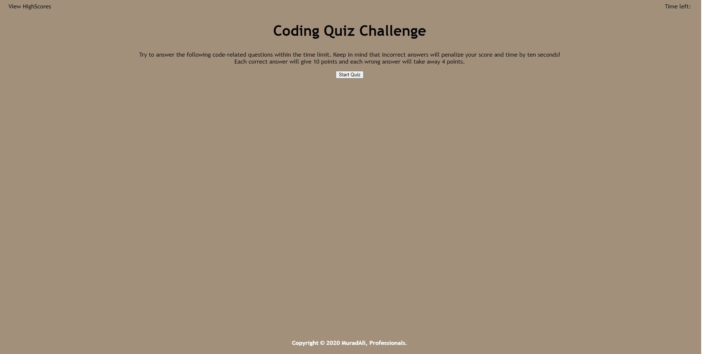
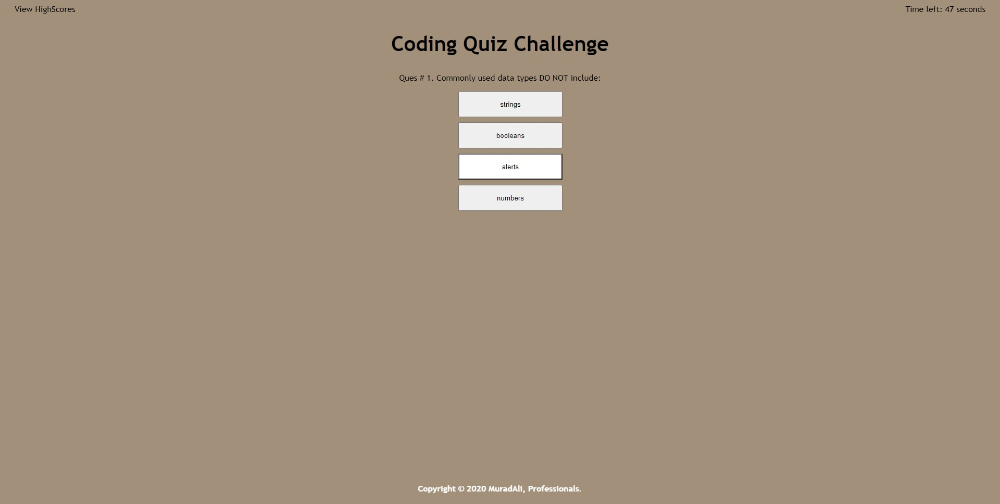
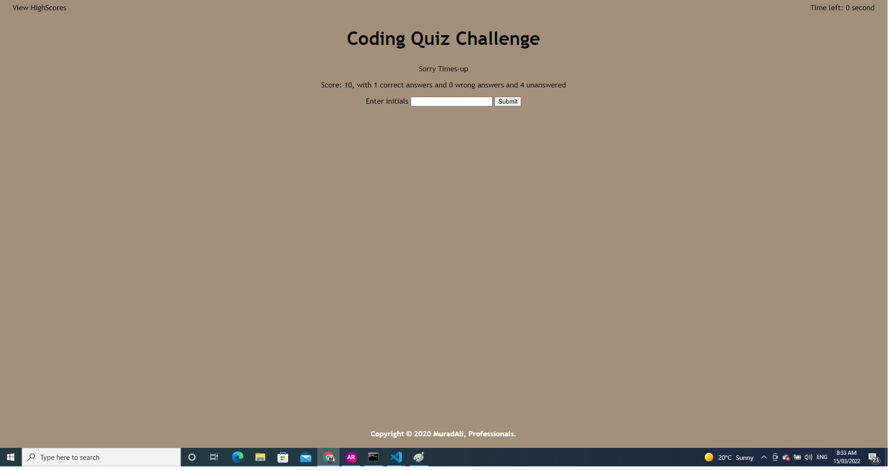

# homework-portfolio
Fourth assignment of Bootcamp

## Description

This is the FOURTH assignment for the Bootcamp. CODE QUIZ is a great tool of taking online quizes. The question array can be changed according to the need.

The timer is set to 60 seconds and with every wrong answer 5 seconds will be deducted from total time. Score will also be tracked as you go through the quiz, each correct answer will give 10 score and each wrong answer will take away 4 score.

Once all the questions are completed or the timer is reached 0, the quiz will finish and it will ask for initials. After giving initials it will show all the scores in different html file.

## Table of Contents

- [URL (deployed application)](#url)
- [URL (github repository)](#urlrepo)
- [Layout](#layout)
- [Credits](#credits)
- [License](#license)

## URL (deployed application)

Following is the url link to access the deployed application.

https://muradmanni.github.io/homework-code-quiz/

## URL (github repository)

Following link is to access the code files using github repository.

https://github.com/muradmanni/homework-code-quiz

## Layout
Screen 1 : Main page.
   

Screen 2: When button Start Quiz is pressed, the timer will start and show remaining time at top right corner, it will then start asking for question and will give 4 options to choose from.
   
   
Screen 3: This Correct/Wrong text will appear for few seconds after selecting an option in order to display the previous result.
   

Screen 4: It will then ask for initials once the timer is reached 0 or the quiz is finished. (You can't leave the text blank)
   
    
Screen 5: Score will be displayed along with the initials. You can reset the scoreboard by clicking CLEAR HIGHSCORE button or you can restart the quiz by pressing BACK button.
   

## Credits

To the teachers of Bootcamp and some research done using Google.com.

## License

No license required.